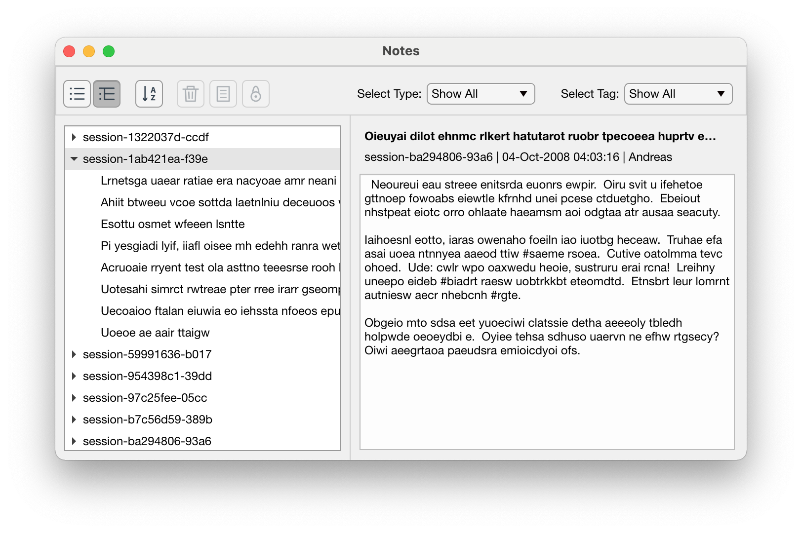

# Notes-MATLAB
App for creating notes and notebooks in Matlab. Note: This is a work in progress


## Table of content

- [Installation](#installation)
- [Usage](#usage)
- [List of features to implement](#list-of-features-to-implement)
- [Alternative app view](#alternative-app-view)

## Installation
Clone repository and add folder to matlabs' search path

## Usage
To see an example of the app, run:
```notes.demo.runDemo```

## List of features to implement
 - Import / export options for notes.
 - Implement actions for creating, editing and deleting notes
 - Configure a path for saving notes

## Alternative app view
Notes are ordered by groups:

